<h1 align="center">alexandrite</h1>
<p align="center">a language implementation for PureScript</p>

---

Alexandrite is a language implementation for PureScript, powered by an incremental, query-based build
system. Instead of a sequence of compiler phases, Alexandrite models compilation and semantic information
as incrementally computed queries. These queries are used extensively to implement code intelligence
features in the language server.

The build system is designed with interactive editing in mind. To support this, it tracks dependencies
between inputs and queries, caches query results, deduplicates in-progress work across threads, and
supports cooperative cancellation when inputs change. Crucially, many query results are designed to
be incrementally reusable. For example, the compiler uses stable identities in lieu of source ranges 
to enable minimal recomputation across trivial formatting changes.

The language server component implements core code intelligence features such as completion, jump to
definition, hover information, find references, workspace symbol search, and diagnostics.

## Editor features

Alexandrite provides code intelligence for PureScript projects through its VS Code extension.

<details>
<summary><strong>Completion</strong></summary>

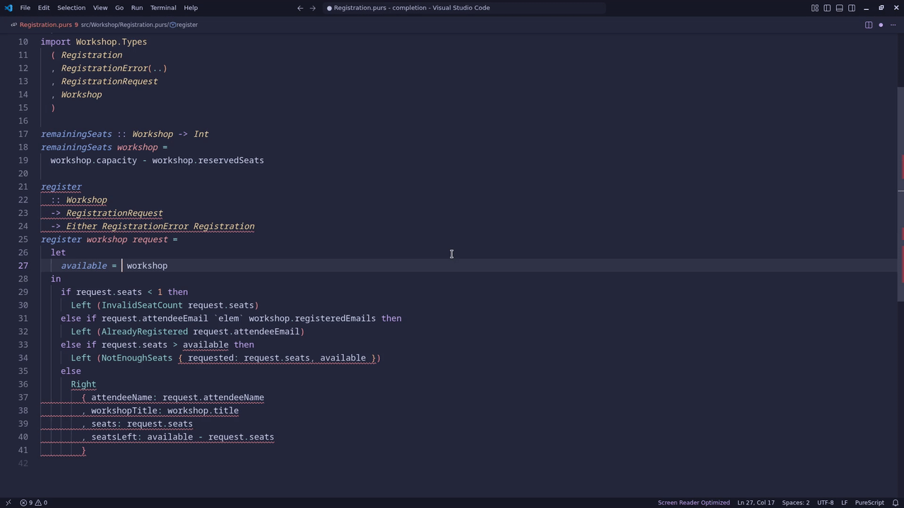

</details>

<details>
<summary><strong>Automatic imports</strong></summary>

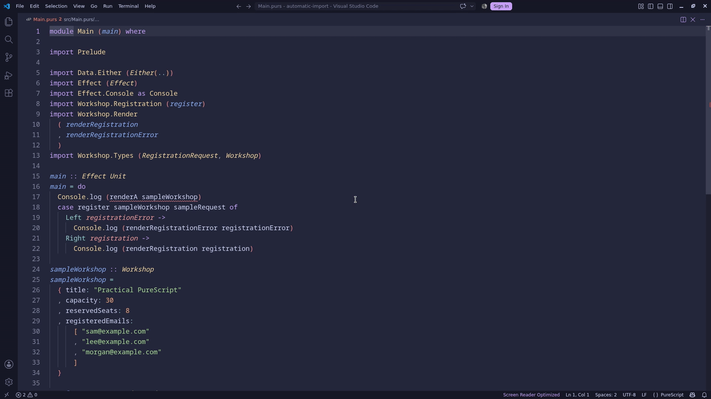

</details>

<details>
<summary><strong>Live diagnostics</strong></summary>

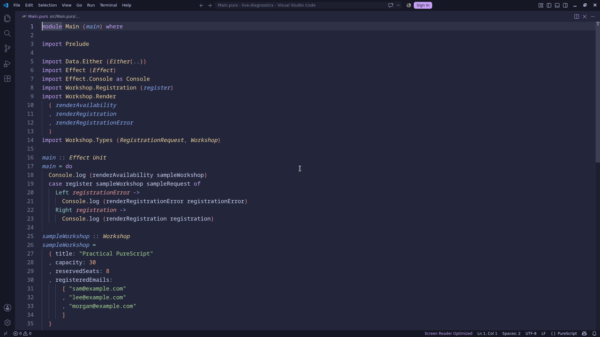

</details>

<details>
<summary><strong>Inferred types</strong></summary>

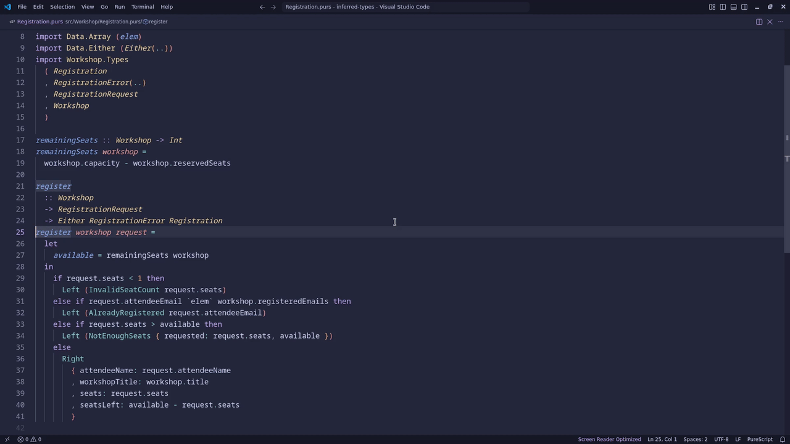

</details>

<details>
<summary><strong>Go to definition</strong></summary>

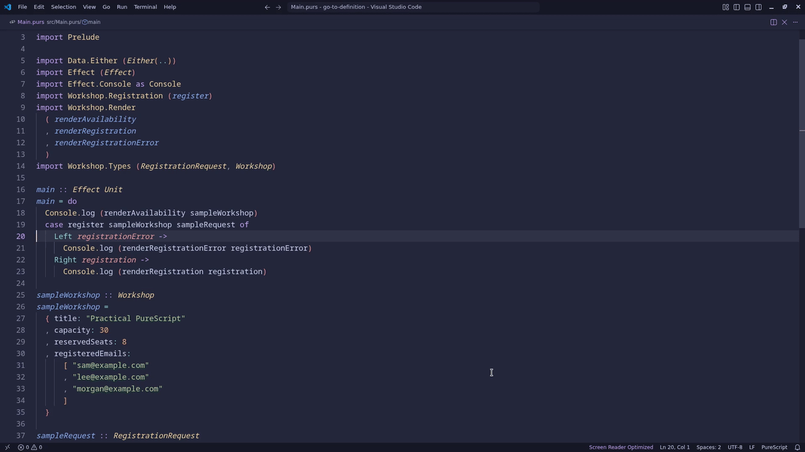

</details>

<details>
<summary><strong>Find references</strong></summary>

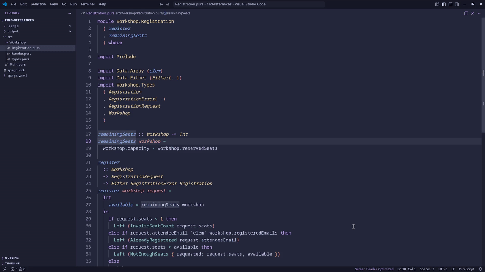

</details>

<details>
<summary><strong>Rename</strong></summary>

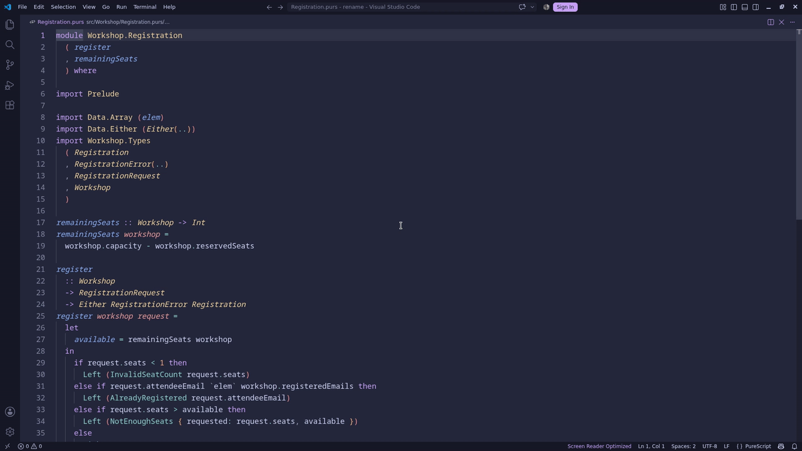

</details>

<details>
<summary><strong>Document symbols</strong></summary>

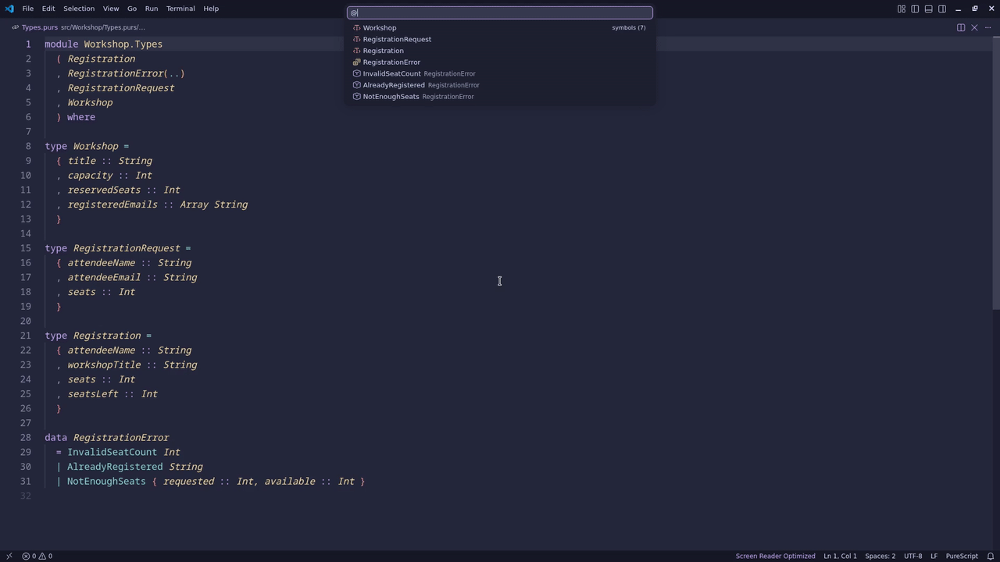

</details>

<details>
<summary><strong>Workspace symbols</strong></summary>

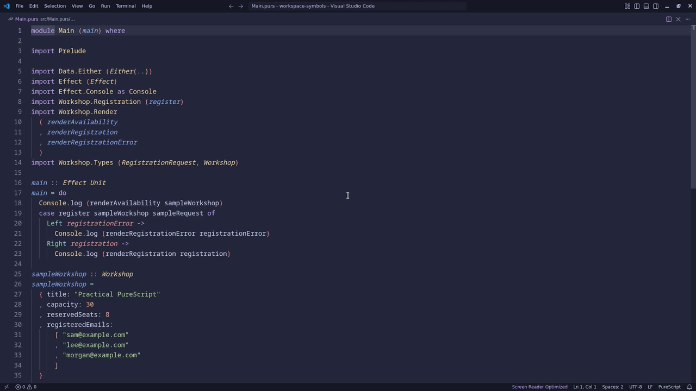

</details>

<details>
<summary><strong>Typed-hole suggestions</strong></summary>

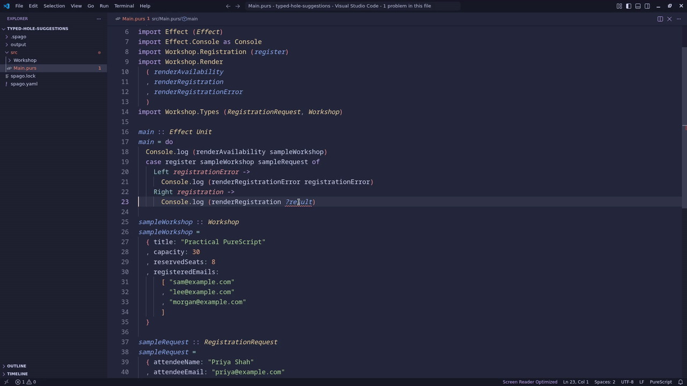

</details>

<details>
<summary><strong>Document highlights</strong></summary>

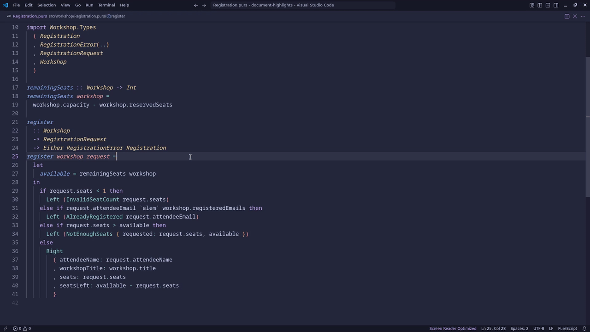

</details>

<details>
<summary><strong>Semantic highlighting</strong></summary>

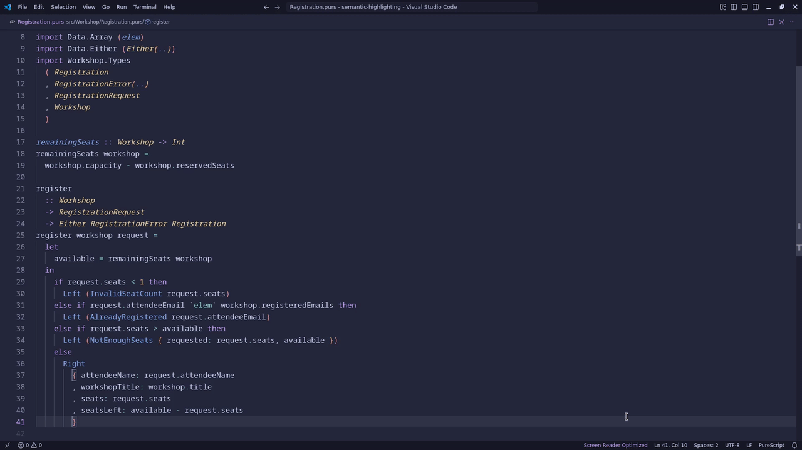

</details>

## Installation

On Linux and macOS:

```sh
curl --proto '=https' --tlsv1.2 -LsSf \
  https://raw.githubusercontent.com/purefunctor/purescript-alexandrite/main/install.sh | sh
```

On Windows PowerShell:

```powershell
irm https://raw.githubusercontent.com/purefunctor/purescript-alexandrite/main/install.ps1 | iex
```

The installers verify the release's GitHub build-provenance attestation when
[GitHub CLI](https://cli.github.com/) is available. They display a warning and continue when it is not
installed. Releases through v0.0.13 predate attestations, so the installers warn and continue without
verification for those versions. Set `ALEXANDRITE_VERSION` to a release tag or
`ALEXANDRITE_INSTALL_DIR` to an installation directory to override the defaults.
